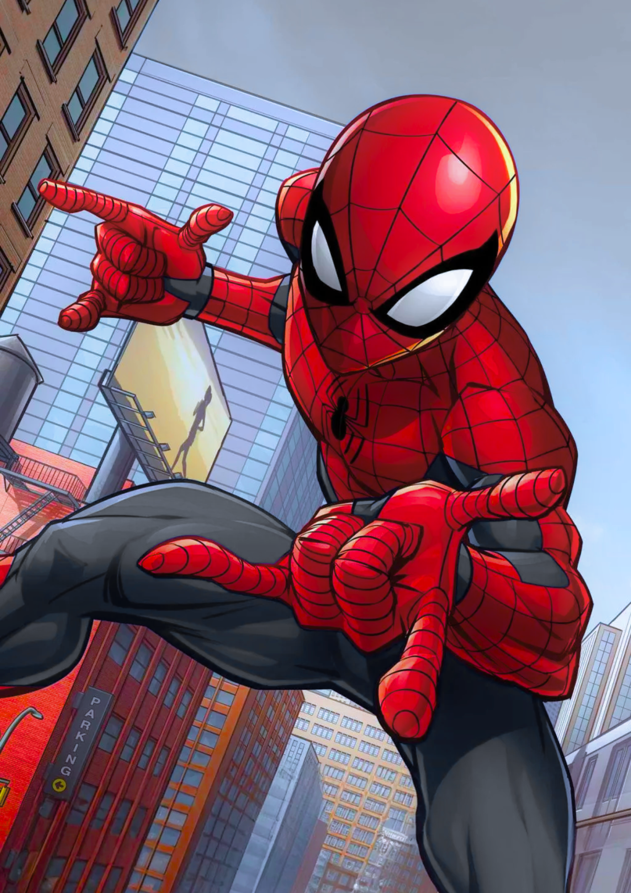

# spideyzoom 🕷️

just got bored at 2:23 am, 
ended up with this at 4:26 am

---
---
---
## This is a fun computer vision mini-project that uses the iconic *Spider-Man hand gesture* to zoom your webcam feed in real-time to simulate the camera being webbed in.
---

## Tech Stack

- Python
- OpenCV
- MediaPipe (Hands)
- NumPy

## Walkthrough

Click the image below to watch the demo

<a href="https://youtu.be/cb76DTkoZBE" target="_blank">
  
</a>

(for those of us who are uncultured, this is the spider-man hand gesture im talking about)

## How it works

- The system detects hand landmarks using MediaPipe.
- If the thumb, index, and pinky are extended (while middle and ring fingers are bent), it triggers a zoom -> 🤟
- With two hands, the zoom centers between them.
- The zoom is implemented digitally by cropping and resizing the webcam feed around the detected hand.
- If both hands are detected doing the gesture simultaneously, then the camera zooms in around the center of both hands.

## Setup and Run instructions

### Setup

Install the dependencies by running the following bash command:
```
pip install opencv-python mediapipe numpy
```

### Run

- Run the script using this command:
```
python spideyzoom.py
```
- Show the Spidey hand pose (thumb, index finger, and little finger extended) to the camera to zoom in.
- Relax your hand to zoom out.
- Press Esc to exit.


---
---
---

```
                             .-"""-.    __                         
                            /       \.-"  "-.                      
                         __:  :\     ;       `.                    
                  _._.-""  :  ; `.   :   _     \                   
                .'   "-.  "   :   \ /;    \    .^.              .-,
    .-".       :        `.     \_.' \'   .'; .'   `.            `
 ,-"    \      ;\         \  '.     /". /  :/       `.      __   _,
 :    '. \_    ; `.  __.   ;_  `-._/   Y    \         `.   (   ".';
 ;      \  `.  :   "-._    ; ""-./      ;    "-._       `--   .'  ;
:    .--.;   \  ;      l   '.    `.     ;        ""--.       /   / 
;   /    :    \/       ;\  . "-.   \___/            __\   .-"_.-"  
;  /     L_    \`.    :  "-.J   "-._/  ""-._       (   \ /   /     
: :      ; \    `.`.  ;     /"+.     ""-.   ""--.._  -, `._."      
 \;     :   \     `.`-'   _/ /  "-.___   "         \`-'            
  `.    ;    \      `._.-"  (     ("--..__..----,   \              
    `. :      ;             /\  .-"\       ,--- ;    ;             
      \;   .-';    _   _.--"  \/    `._,-.----' |    ;             
       :     :---"" """        `.     _:'.`.\   :    ;\            
        \  , :                   "-. (,-\ ` /   ;\(// \\           
         `:   \                     "-___.-"    '-\\   \;          
           \   :                .----,             \;              
            `--'                `--`-'                             
                              .--                                  
                              `-:_                                 
                                 \)                                
                                  `--'
```

enjoy :)
